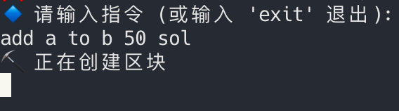
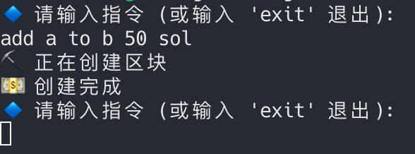
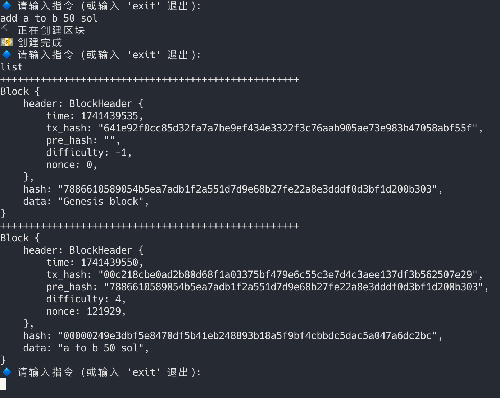
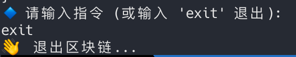
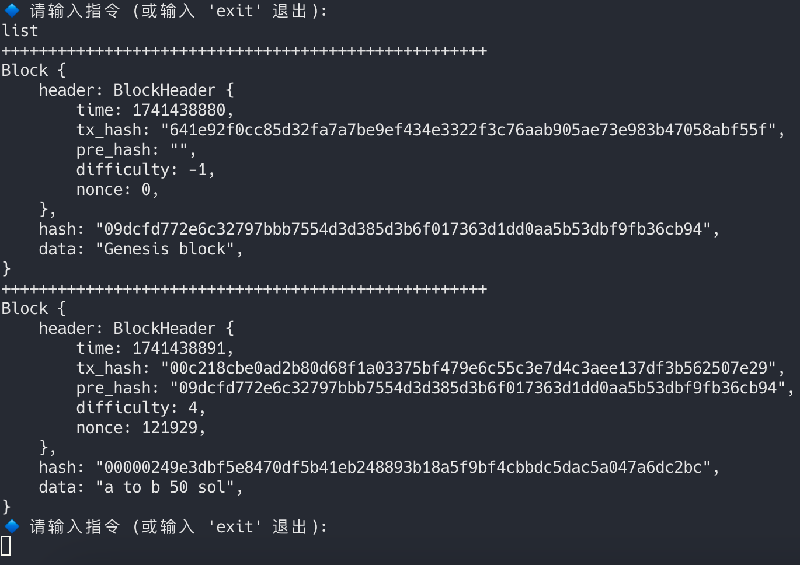
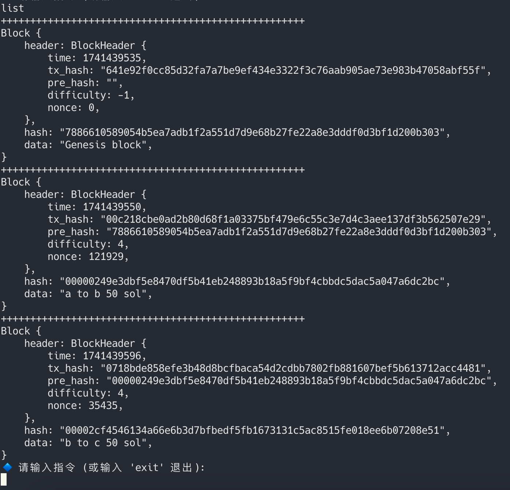
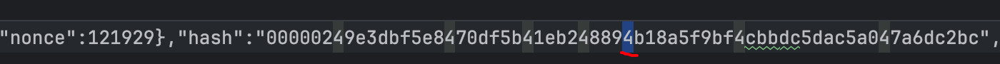
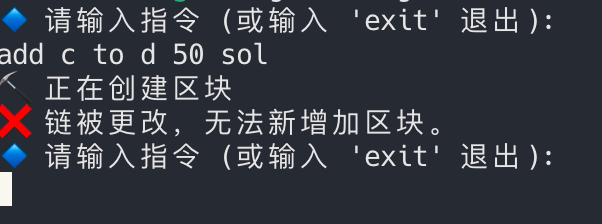
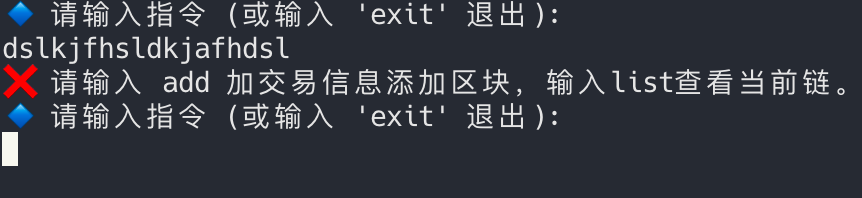

# 项目说明

### 1 **Rust 简单区块链（支持 PoW）**

本项目是一个使用 **Rust** 编写的 **简易区块链系统**，包含 工作量证明（PoW），支持通过终端命令添加区块。

### 2 功能

- 区块链功能实现
- 工作量证明（可调整难度）
- 持久化
- 链hash安全验证
- 终端交互

### 3 数据结构

- core::Block

```rust
#[derive(Debug, Serialize, Deserialize, PartialEq)]
pub struct BlockHeader {
    pub time: i64,
    // 当前块数据唯一哈希
    pub tx_hash: String,
    // 上一个块的哈希
    pub pre_hash: String,
    // 挖矿难度
    difficulty: i32,
    // 块递增随机数
    nonce: u64,
}

#[derive(Debug, Serialize, Deserialize, PartialEq)]
pub struct Block {
    pub header: BlockHeader,
    pub hash: String,
    pub data: String,
}
```

- core::BlockChain

```rust
#[derive(Debug, Deserialize, Serialize, PartialEq)]
pub struct BlockChain {
    //链的载体
    pub blocks: Vec<Block>,
    // 工作量证明的难度
    difficulty: i32,
}
```

### 4 PoW 实现

在生成每一个区块时调用。

```rust
fn proof_of_work(&mut self) {
        if self.header.difficulty < 0 {
            return;
        }
        let target_prefix = "0".repeat(self.header.difficulty as usize);
        while !self.hash.starts_with(&target_prefix) {
            self.hash = self.calculate_hash();
            self.header.nonce += 1;
        }
}
```

如果是创世区块 难度系数为 -1 不需要进行证明

```rust
    fn new_genesis_block() -> Block {
        Block::new_block("Genesis block".to_string(), String::from(""), -1)
    }
```


其它区块通过计算区块`header`的`hash`是否有指定个前缀0作为工作完成标准，递增随机数每次递增1。

### 5 持久化

持久化模块分离方便扩展

/ Cargo.toml

```toml
[workspace]
members = [
    "main",
    "core",
    "utils",
    "file_db"]
```

后续扩展的持久化都需要实现Db的接口

```rust
pub trait DbTrait {
    fn save_chain(&self, chain: &mut BlockChain);
    fn load_chain(&self) -> BlockChain;
    fn is_chain_exist(&self) -> bool;
}
```

采用文件系统对链进行持久化，保存为可读的Json

```rust
fn save_chain(&self, block_chain: &mut BlockChain) {
        let json = serde_json::to_string(block_chain).unwrap();
        let mut file = fs::File::create(FILE_NAME).unwrap();
        file.write(json.as_bytes()).unwrap();
    }
```

同样有加载过程

```rust
    fn load_chain(&self) -> BlockChain {
        let mut file = fs::File::open(FILE_NAME).unwrap();
        let data: BlockChain = serde_json::from_reader(&mut file).unwrap();
        data
    }
```

调用时机

在程序启动会判断是否有历史数据，有就加载，没有就创建新链并持久化

```rust
    pub fn new_block_chain(difficulty: i32, db: &dyn DbTrait) -> BlockChain {
        if db.is_chain_exist() {
            return db.load_chain()
        }
        let mut chain = BlockChain {
            blocks: vec![BlockChain::new_genesis_block()],
            difficulty,
        };
        db.save_chain(&mut chain);// <- 调用
        chain
    }
```

当构建好新块并更新到链上后，调用保存整个链。

```rust
    pub fn add_block(&mut self, data: String, db: &dyn DbTrait) -> Result<(), String> {
        let pre_block = &self.blocks.last().unwrap();
        let new_block = Block::new_block(data, pre_block.hash.clone(), self.difficulty);
        if self.block_chain_is_valid() {//<- 调用验证链是否被修改
            self.blocks.push(new_block);
            db.save_chain(self);// <-调用
            Ok(())
        } else {
            Err("valid failed".to_string())// <- 验证失败返回message
        }
    }
```

### 6 链安全验证

通过遍历区块链到链尾，对比前一个链的hash和后一个链的pre_hash来保证安全，调用位置见第五节最后一个代码块。

```rust
    fn block_chain_is_valid(&self) -> bool {
        for i in 1..self.blocks.len() {
            let block = &self.blocks[i];
            let pre_block = &self.blocks[i - 1];
            if block.header.pre_hash != pre_block.hash {
                return false;
            }
        }
        true
    }
```

由于要加入的块依赖当前最后一个块生成所以无法校验。

### 7 终端交互

用CliHandler包装交互逻辑流

```rust
fn main() {
    let db = Db;// <- 加载对应存储系统
    // 新建链
    let mut bc = block_chain::BlockChain::new_block_chain(4, &db);//<-拿到链
    CliHandler::run(&mut bc, &db);//<-交互逻辑
}
```

 CliHandler::run主要输出几种信息并都有对应提示

- `🔹 请输入指令 (或输入 'exit' 退出): `：等待阶段
- `👋  退出区块链...`：退出提示
- `⛏️ 正在创建区块`：区块创建中
- `💵 创建完成`：创建完成提示
- `❌ 链被更改，无法新增加区块。`：链被修改报错提示，解决办法只有删除数据
- `❌ 请输入 add 加交易信息添加区块，输入list查看当前链。`：输入help

### 8 运行演示

#### 8.1、位于项目根目录启动项目

```
cargo run
```

会看见


#### 8.2、输入指令添加区块

```
add a to b 50 sol
```

可看到正在创建区块



等工作量完成可看到创建完成，系统进入等待阶段



#### 8.3 查看区块list

输入list可以查看当前区块链数据

```
list
```



#### 8.4 输入exit退出程序

```
exit
```



#### 8.5 在打开程序输入list可以查看之前的数据

```
cargo run
```

```
list
```



#### 8.6 恶意篡改中间块的hash无法插入新块

再先插入一个块之后退出程序

```
add b to c 50 sol
```

```
exit
```



之后修改本地存储文件中第二个块的一个hash，如果修改最后一个块的hash需要引入新的验证方式才能验证出来



之后启动项目尝试添加新块

```
cargo run
```

```
add c to d 50 sol
```

出现报错提示



#### 8.7 输入乱码

为保护系统，如果输入不识别的指令如

```
dslkjfhsldkjafhdsl
```

会出现提示进行引导



